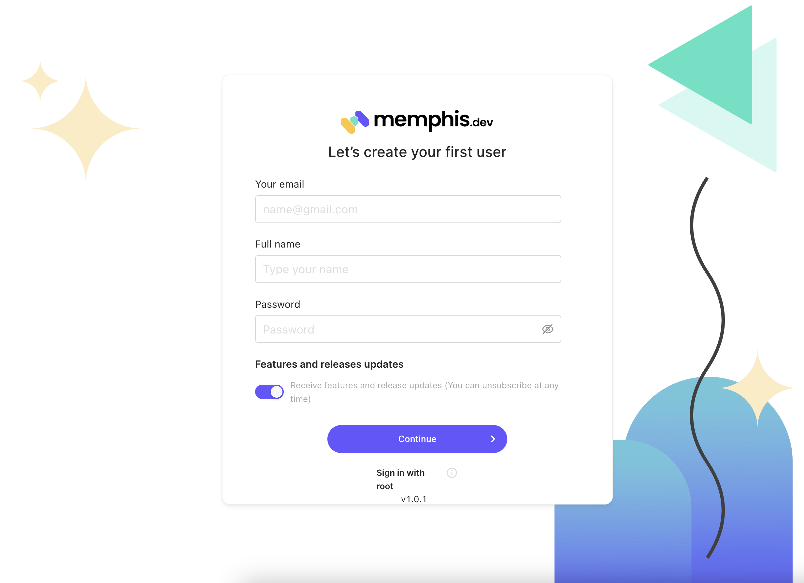
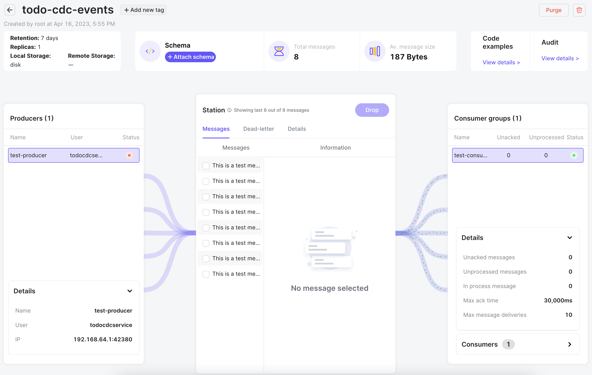

# Setting up Memphis
Memphis.dev must be configured for use with the CDC example.

## Setting up a Station and User
In Memphis.dev, topics are called "stations".  When Memphis.dev is run for the first time, the web UI provides a wizard for creating your first station and user.

1. Point your browser to [http://localhost:9000](http://localhost:9000/).  Click "Sign in with root" at the bottom.
   
1. Log in with the username "root" and the password "memphis"
   
1. Create your first station.  Enter the station name as "raw-todo-cdc-events".  Leave the other settings at their defaults and click the "Next" button in the bottom right.
   
1. Create your first user.  Use the "todocdcservice" as the username and password.  Click the "Next" button in the bottom right.
   
1. Click "Next" button on the producer and consumer example screens and finalize the creation.
1. You will be forwarded to the details screen for the new "raw-todo-cdc-events" station.
   

## Testing the Memphis.dev Configuration
Example producer and consumer Python scripts are provided to test your setup.

### Start the Consumer
1. Open a terminal to run the consumer
1. Navigate to `../memphis-setup-testing`.
1. Create a Python virtual environment
   ```bash
   $ python3 -m venv venv
   $ source venv/bin/activate
   (venv) $
   ```
1. Update pip
   ```bash
   (venv) $ pip install -U pip wheel
   ```
1. Install the dependencies
   ```bash
   (venv) $ pip install -r requirements.txt
   ```
1. Start the consumer
   ```bash
   (venv) $ python3 test_consumer.py
   Waiting on messages...
   
   ```

### Start the Producer
1. Open a terminal to run the consumer
1. Navigate to `../memphis-setup-testing`.
1. Start the Python virtual environment created in the previous part
   ```bash
   $ source venv/bin/activate
   (venv) $
   ```
1. Start the producer
   ```bash
   (venv) $ python3 test_producer.py
   Sending message: This is a test message.
   Sending message: This is a test message.
   Sending message: This is a test message.
   Sending message: This is a test message.
   Sending message: This is a test message.   
   ```
1. Press Ctrl-C after a couple of seconds to kill the producer
1. Close the terminal

### Check the Consumer
In the terminal window running the consumer, you should see the following output:

```bash
Waiting on messages...
message:  bytearray(b'This is a test message.')
message:  bytearray(b'This is a test message.')
message:  bytearray(b'This is a test message.')
message:  bytearray(b'This is a test message.')
message:  bytearray(b'This is a test message.')
message:  bytearray(b'This is a test message.')
message:  bytearray(b'This is a test message.')
message:  bytearray(b'This is a test message.')

```

### Check the Memphis.dev UI Station Details
Navigate to the Memphis.dev UI details screen for the "todo-cdc-events" station in your browser.  You should see the test messages, consumer, and producer:


