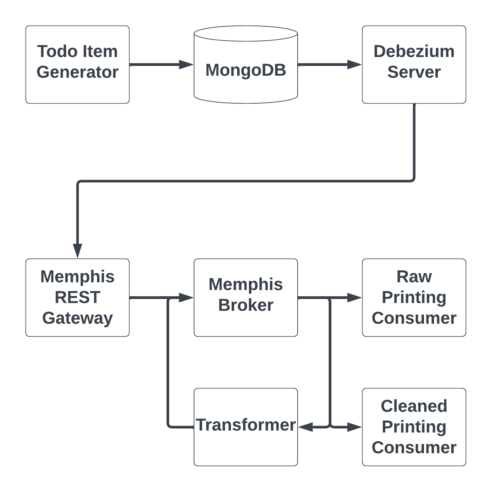

# MongoDB Debezium CDC Example with Message Transformation

## Use Case Description
Change data capture (CDC) is an increasingly popular pattern for monitoring
granular changes to databases. CDC implementations generate events in response
to changes in data induced by queries (e.g., inserts, deletes, and updates).
The events are then transmitted to external observers (listeners).  CDC effectively
turns the traditional database into event source for an event-driven architecture.

CDC has multiple uses, including:

* Replicating data to secondary databases with implementations optimized for complementary workloads (e.g., transaction vs analytical processing)
* Real-time analytics (e.g., calculations and aggregations that power dashboards)
* Real-time monitoring of suspicious or unexpected events

## Solution Description
In this example solution, we illustrate a CDC solution for MongoDB using Debezium that
replaces [Apache Kafka](https://kafka.apache.org/) with the [Memphis.dev](https://github.com/memphisdev/memphis)
message broker.  Memphis.dev requires less operational overhead, making it ideal for lean
teams who want to focus on their customers.

The solution uses the example of a table for storing items in a todo application.  A script
generates random todo items and inserts them into the MongoDB database.  The database is
configured with replication.  Debezium is configured in standalone
server mode to listen for events and sends them to Memphis.dev through the REST gateway.

For MongoDB, Debezium CDC messages are serialized as a string within the overall CDC JSON record.
We eventually want to use Memphis.dev's Schemaverse functionality to filter out messages that don't
confirm to our desired schema.  We implement a simple service that consumes the raw CDC events,
deserializes the MongoDB record, and produces the resulting JSON records to another station.
A diagram of the architecture is provided below.

## Steps for Running the Example

1. Build the Docker images:
   `docker compose build --pull --no-cache`
1. Start Memphis.dev:
   `docker compose up -d memphis-rest-gateway`
1. [Configure Memphis.dev](docs/setup_memphis.md)
1. Start the printing consumer for the raw events:
   `docker compose up -d raw-printing-consumer`
1. Start the printing consumer for the cleaned events:
   `docker compose up -d cleaned-printing-consumer`
1. Start the CDC event transformer:
   `docker compose up -d cdc-transformer`   
1. Start MongoDB, run the database setup, and start the todo generator:
   `docker compose up -d todo-generator`
1. Start the Debezium Server:
   `docker compose up -d debezium-server`
1. Check the container statuses (`docker ps`), Memphis.dev station overview, and [Docker logs](docs/inspect_logs.md) to confirm it works

Note: We currently build our own Docker image for Debezium Server from the main branch because JWT authentication (see [this PR](https://github.com/debezium/debezium-server/pull/20)) is not yet available in a released version.
