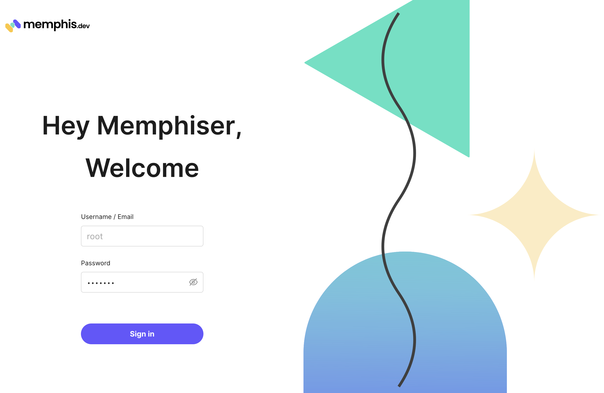
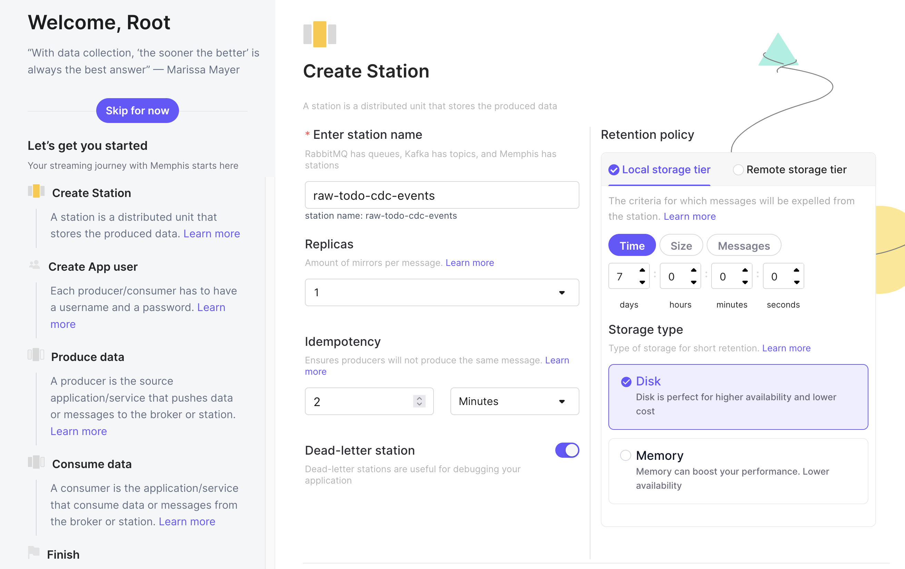
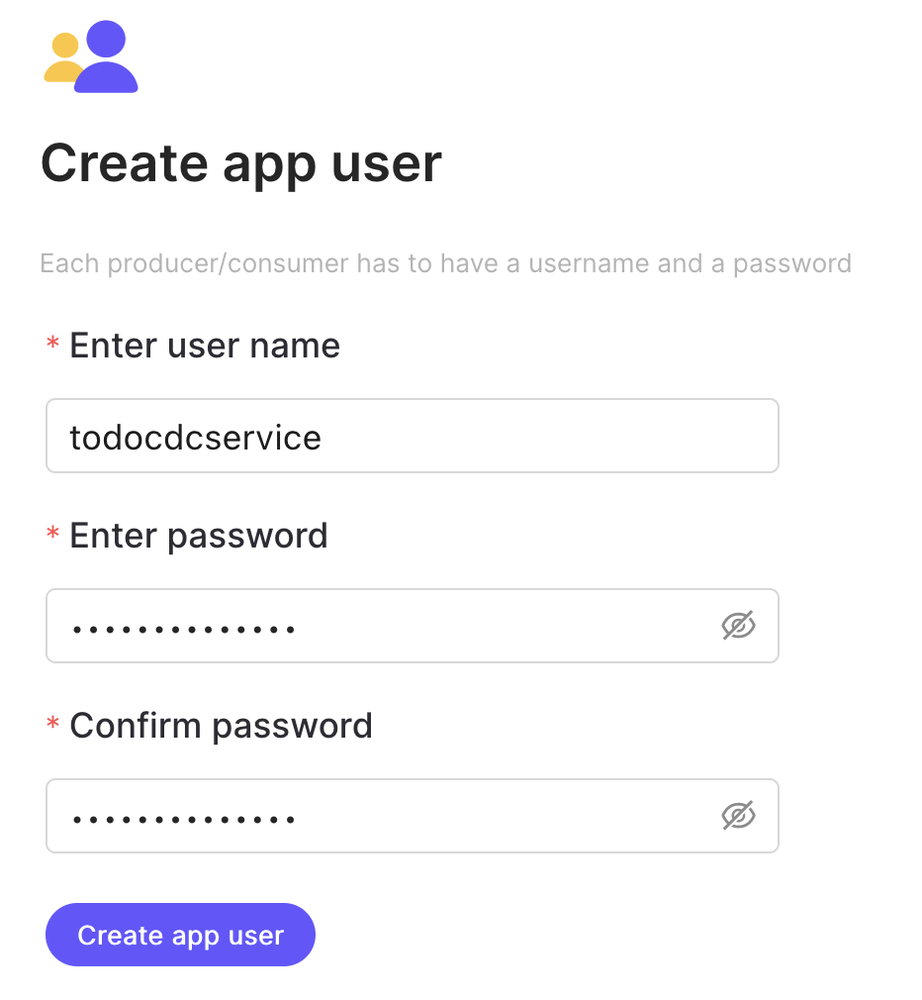
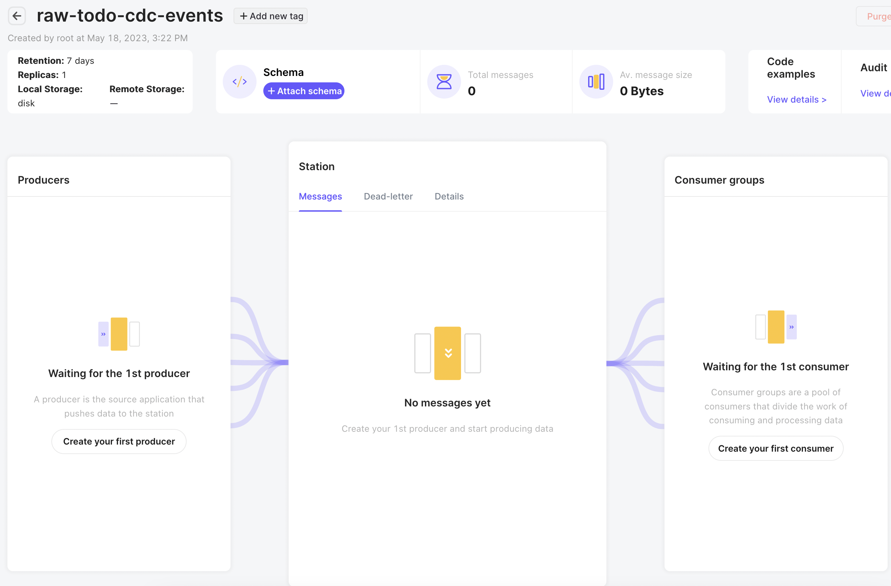
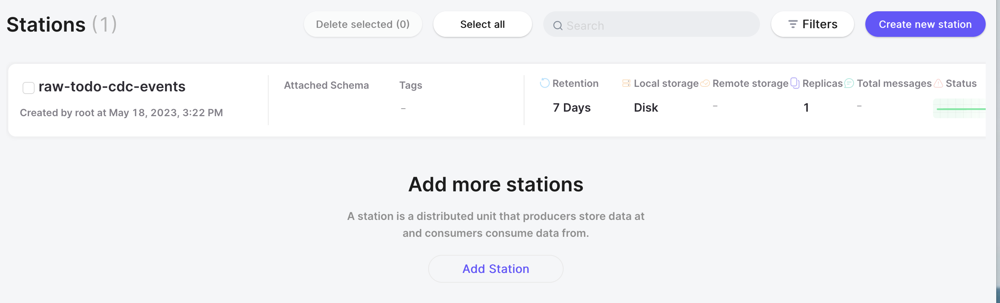
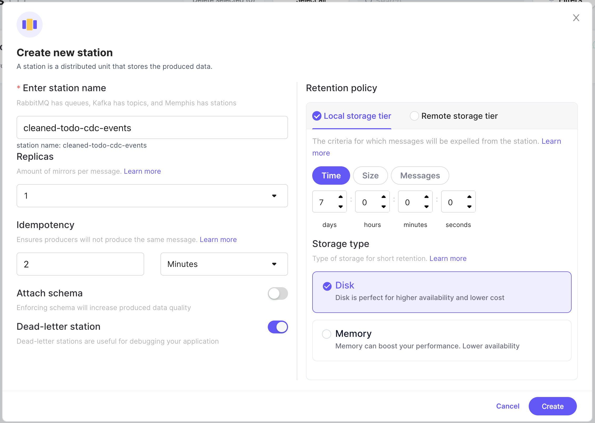
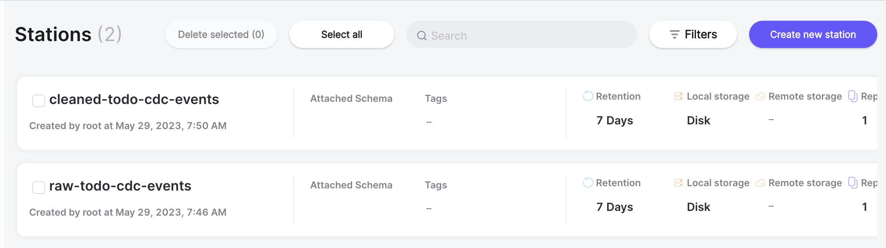

# Setting up Memphis
Memphis.dev must be configured for use with the CDC example.  In Memphis.dev, topics are called "stations".  When Memphis.dev is run for the first time, the web UI provides a wizard for creating your first station and user.

1. Point your browser to [http://localhost:9000](http://localhost:9000/).  Click "Sign in with root" at the bottom.
   
1. Log in with the username "root" and the password "memphis"
   
1. Create your first station.  Enter the station name as "raw-todo-cdc-events".  Leave the other settings at their defaults and click the "Next" button in the bottom right.
   
1. Create your first user.  Use the "todocdcservice" as the username and password.  Click the "Next" button in the bottom right.
   
1. Click "Next" button on the producer and consumer example screens and finalize the creation.
1. You will be forwarded to the details screen for the new "raw-todo-cdc-events" station. Click the "arrow" button in upper left to go to the station overview page.
   
1. On the station overview page, click the "Add New Station" button.
   
1. Create a station named "cleaned-todo-cdc-events".
   
1. The station overview page will now show both stations.
   
   
