# MongoDB Debezium CDC Example

## Use Case Description
Change data capture (CDC) is an increasingly popular pattern for monitoring
granular changes to databases. CDC implementations generate events in response
to changes in data induced by queries (e.g., inserts, deletes, and updates).
The events are then transmitted to external observers (listeners).  CDC effectively
turns the traditional database into event source for an event-driven architecture.

CDC has multiple uses, including:

* Replicating data to secondary databases with implementations optimized for complementary workloads (e.g., transaction vs analytical processing)
* Real-time analytics (e.g., calculations and aggregations that power dashboards)
* Real-time monitoring of suspicious or unexpected events

## Part 1: Setup MongoDB, Debezium Server, and Memphis.dev
In this example solution, we illustrate a CDC solution for MongoDB using Debezium that
replaces [Apache Kafka](https://kafka.apache.org/) with the [Memphis.dev](https://github.com/memphisdev/memphis)
message broker.  Memphis.dev requires less operational overhead, making it ideal for lean
teams who want to focus on their customers.

The solution uses the example of a table for storing items in a todo application.  A script
generates random todo items and inserts them into the MongoDB database.  The database is
configured with replication.  Debezium is configured in standalone
server mode to listen for events and sends them to Memphis.dev through the REST gateway.
The CDC events are pulled from the Memphis.dev station by a simple consumer example
that prints the events to the console.  A diagram of the architecture is provided below.

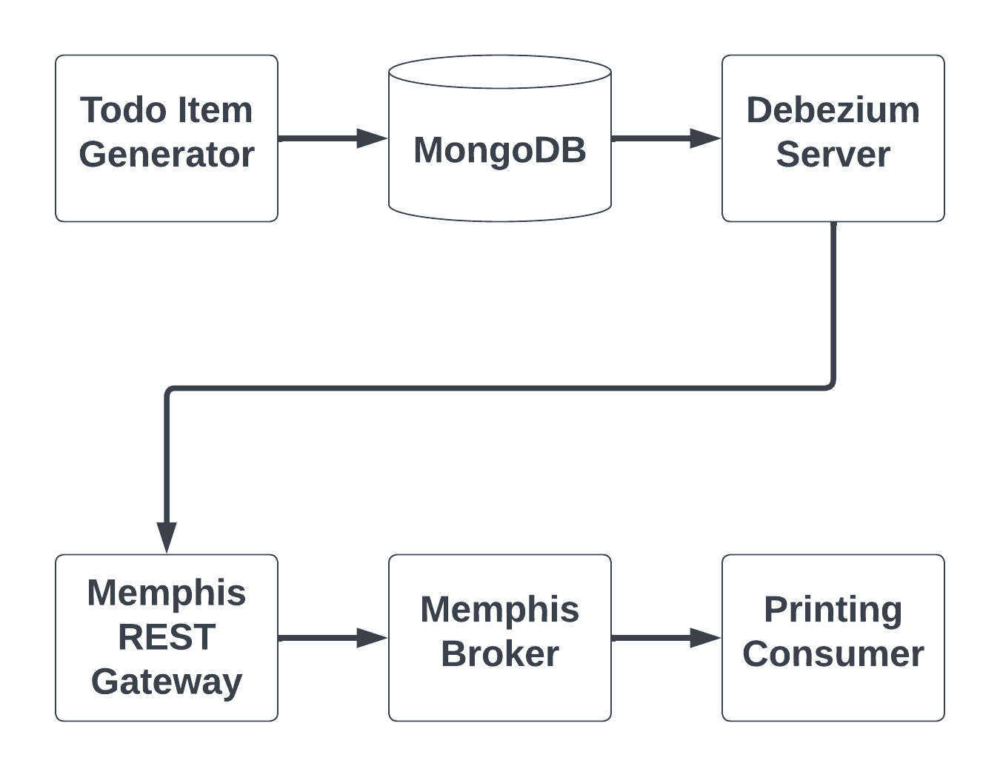


1. Build the Docker images:
   `docker compose build --pull --no-cache`
1. Start Memphis.dev:
   `docker compose up -d memphis-rest-gateway`
1. [Configure Memphis.dev](docs/setup_memphis.md)
1. Start the printing consumer:
   `docker compose up -d printing-consumer`
1. Start MongoDB, run the database setup, and start the todo generator:
   `docker compose up -d todo-generator`
1. Start the Debezium Server:
   `docker compose up -d debezium-server`
1. Check the container statuses (`docker ps`), Memphis.dev station overview, and [Docker logs](docs/inspect_logs.md) to confirm it works

## Part 2: Add CDC event message transformer
Debezium Server serializes the MongoDB records as strings within the JSON document like so:

```json
{
	"schema" : ...,

	"payload" : {
		"before" : null,

		"after" : "{\\"_id\\": {\\"$oid\\": \\"645fe9eaf4790c34c8fcc2ed\\"},\\"creation_timestamp\\": {\\"$date\\": 1684007402978},\\"due_date\\": {\\"$date\\": 1684266602978},\\"description\\": \\"buy milk\\",\\"completed\\": false}",

		...
	}
}
```

This will limit our ability to apply [Schemaverse](https://docs.memphis.dev/memphis/memphis/schemaverse-schema-management) to perform validation of the MongoDB records.

In part 2, we're going to start a transformer service that consumes events from the `todo-cdc-events` station, deserializes the MongoDB records, and pushes the records to a new station, `cleaned-todo-cdc-events`.  Our updated architecture will look like so:

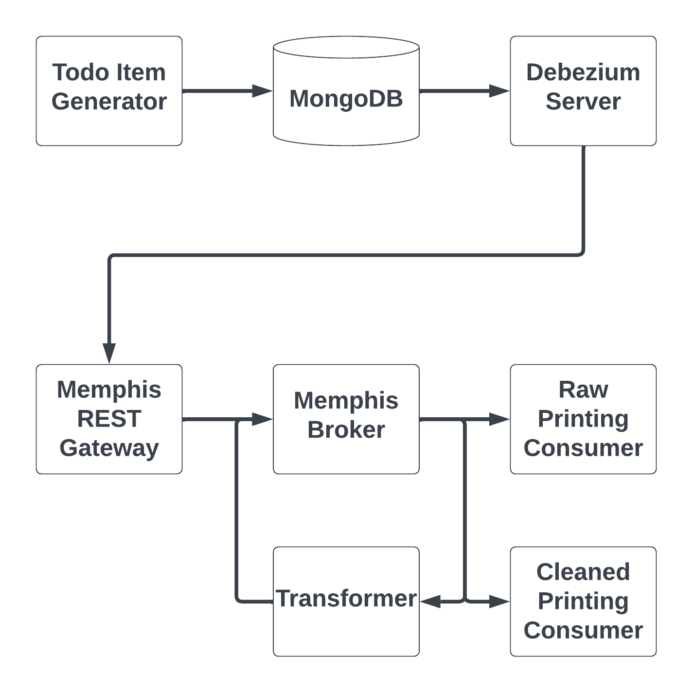

After running the steps in part 1, do the following:

1. Start the CDC transformer service:
   `docker compose up -d cdc-transformer`
1. Start a second printing consumer:
   `docker compose up -d cleaned-printing-consumer`

Memphis.dev will automatically create the `cleaned-todo-cdc-events` station once the transformer starts producing messages to it.
The second station should be visible on the Memphis.dev UI station overview page like so:

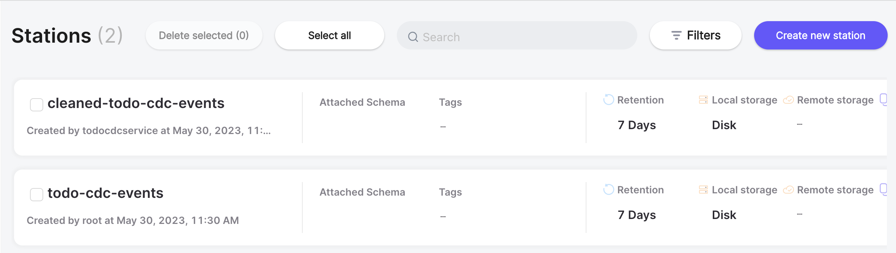

If looking at the details for the `cleaned-todo-cdc-events` station, you should see the attached transformer producer,
attached printing consumer, and transformed messages:

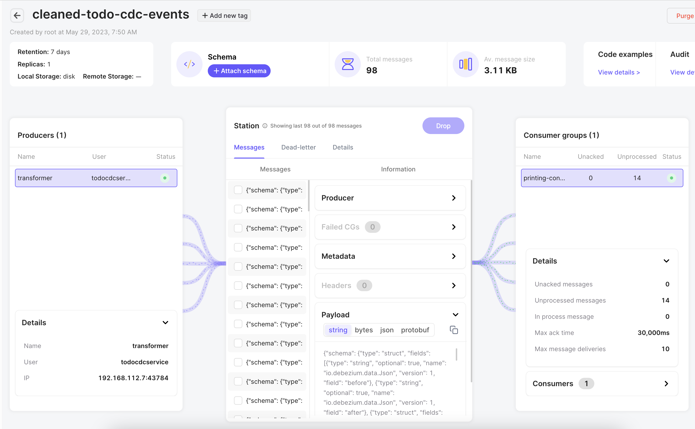

## Part 3: Enabling Schema Validation
Memphis.dev has an awesome functionality called Schemaverse.  It allows operators to define schemas that are applied to incoming messages.
If a message does not validate against the schema, it will be redirected to the dead-letter station. This prevents invalid messages
from causing problems downstream.  At the same time, invalid messages are retained so they can be reprocessed.

In part 3, we're going to create a schema and attach it to the `cleaned-todo-cdc-events` station.

1. Navigate to the Schemaverse tab in the Memphis.dev UI:

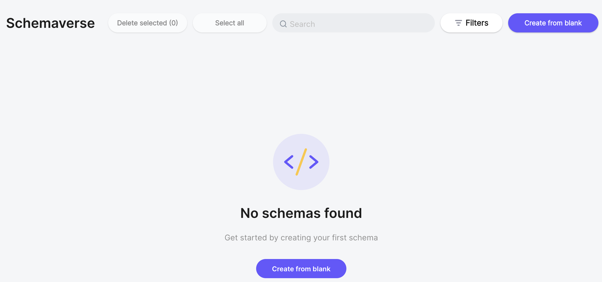

2. Click on one of the "Create from blank" buttons to bring up the "Create schema" window.  Enter "todo-cdc-schema" as the name, select
"JSON schema" under "Data format", and paste the following JSON into the "Schema structure" box:

   ```json
{
	"$schema": "https://json-schema.org/draft/2020-12/schema",
	"$id": "https://example.com/product.schema.json",
	"type" : "object",
	"properties" : {
		"payload" : {
			"type" : "object",
			"properties" : {
				"before" : {
					"oneOf" : [{ "type" : "null" }, { "$ref" : "#/$defs/todoItem" }]
				},
				"after" : {
					"oneOf" : [{ "type" : "null" }, { "$ref" : "#/$defs/todoItem" }]
				}
			},
			"required" : ["before", "after"]
		}
	},
	"required" : ["payload"],
   "$defs" : {
	  "todoItem" : {
		  "title": "TodoItem",
		  "description": "An item in a todo checklist",
	  	  "type" : "object",
		  "properties" : {
			  "_id" : {
				  "type" : "object",
				  "properties" : {
					  "$oid" : {
						  "type" : "string"
					  }
				  }
			  },
			  "description" : {
				  "type" : "string"
			  },
			  "creation_timestamp" : {
				  "type" : "object",
				  "properties" : {
					  "$date" : {
						  "type" : "integer"
					  }
				  }
			  },
			  "due_date" : {
			  		"anyOf" : [
						{
							"type" : "object",
							"properties" : {
								"$date" : {
									"type" : "integer"
								}
							}
						},
						{
							"type" : "null"
						}
					]
			  },
			  "completed" : {
				  "type" : "boolean"
			  }
		  },
		  "required" : ["_id", "description", "creation_timestamp", "completed"]
	  }
  }
}
```

   The window should look like so when done:

   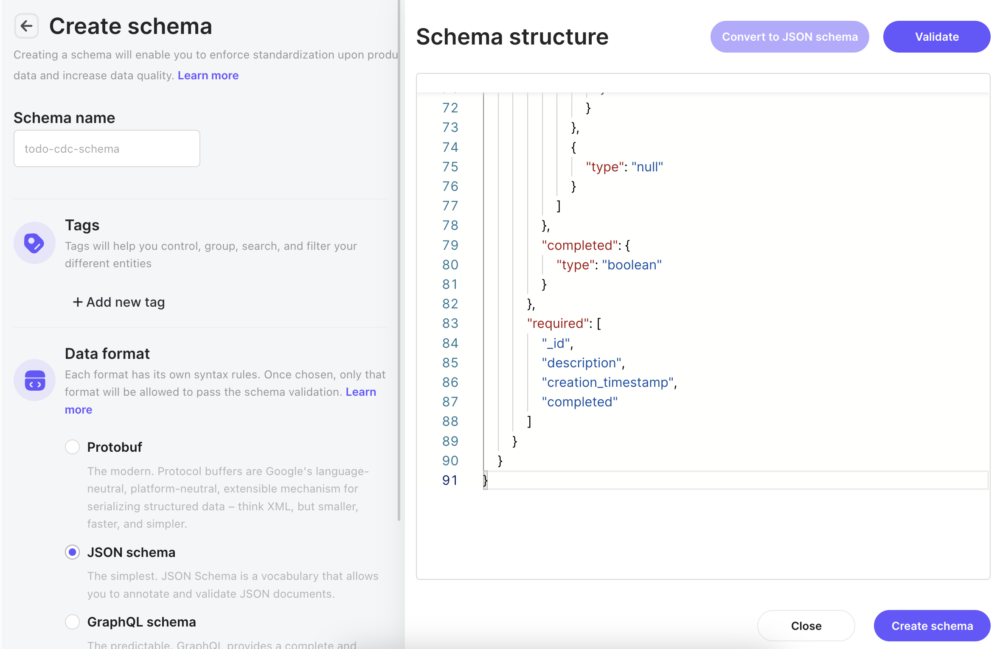

1. Click the "validate" button to ensure that your schema is syntactically correct.  The window should show the message "Schema is valid."

   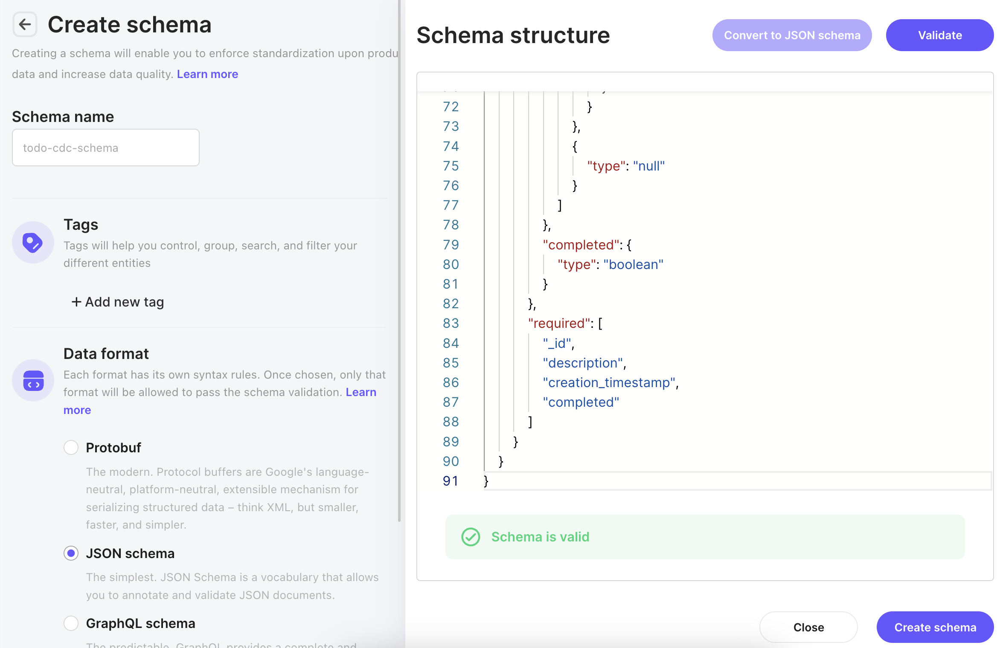

1. Click the "Create schema" button.  You'll be returned to the Schemaverse tab, and the new schema will be shown.

   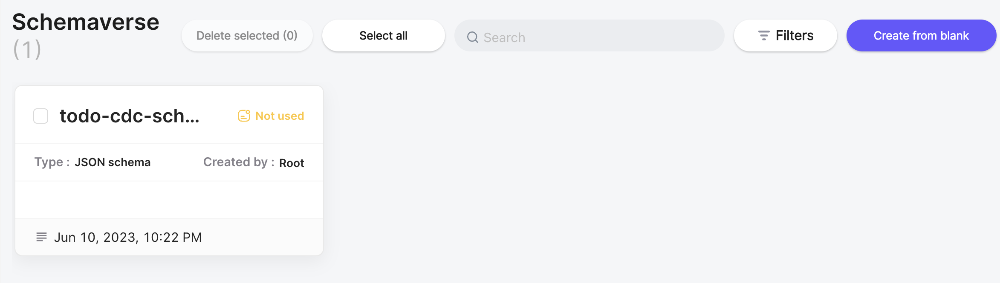

1. Double click on the "todo-cdc-schema" box to bring up its configuration window.

   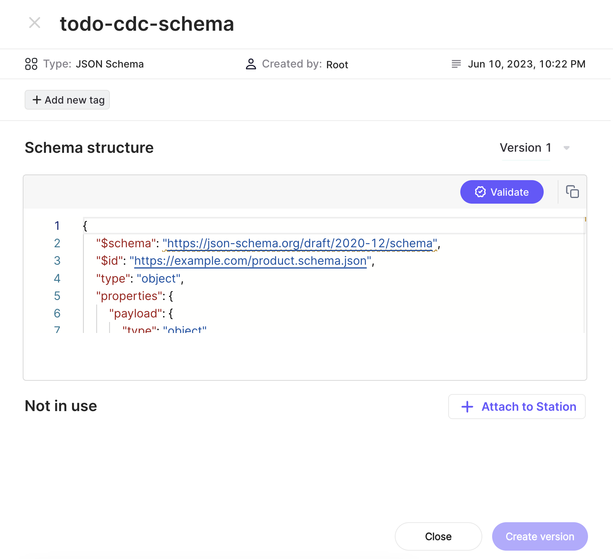

1. Click "+ Attach to station"

1. Select "cleaned-todo-cdc-events" and click "Attach Selected".

   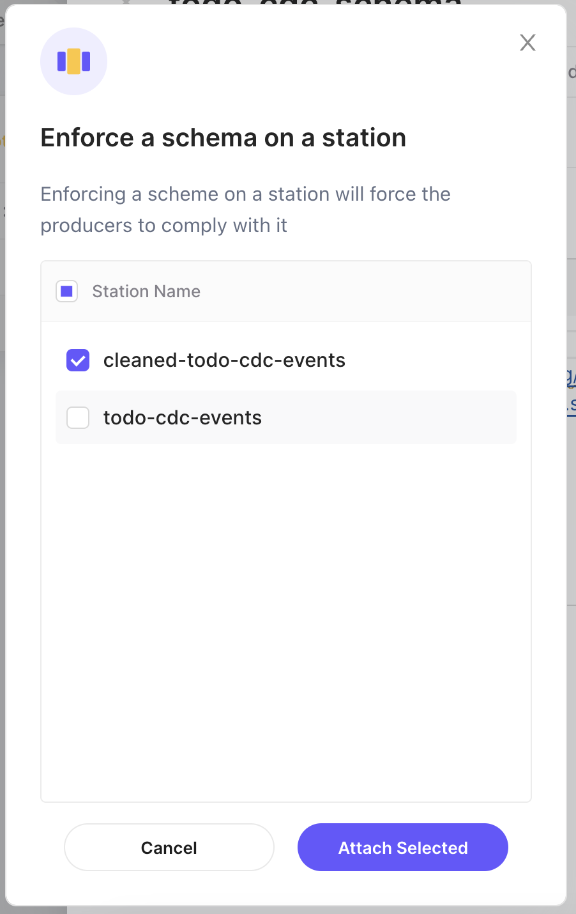

1. If you return to the window for "cleaned-todo-cdc-events" station, you will now see that the schema is attached and an error next to
"Dead-letter".

   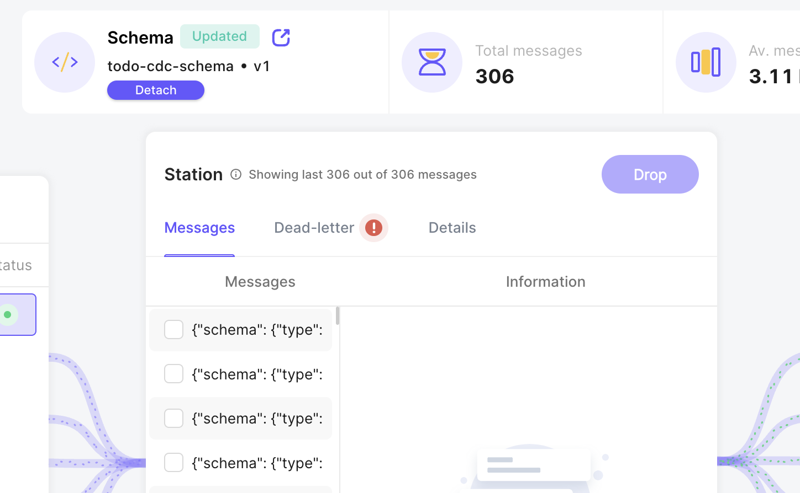

1. If you click on "Dead-letter" and then "Schema violation", you'll see a list of messages that have been sent to the dead-letter station
because they didn't validate against the schema.

   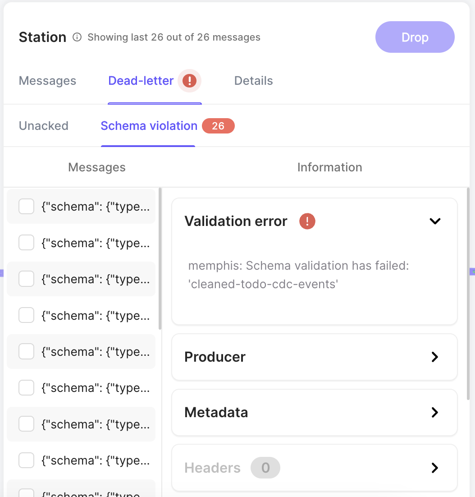
