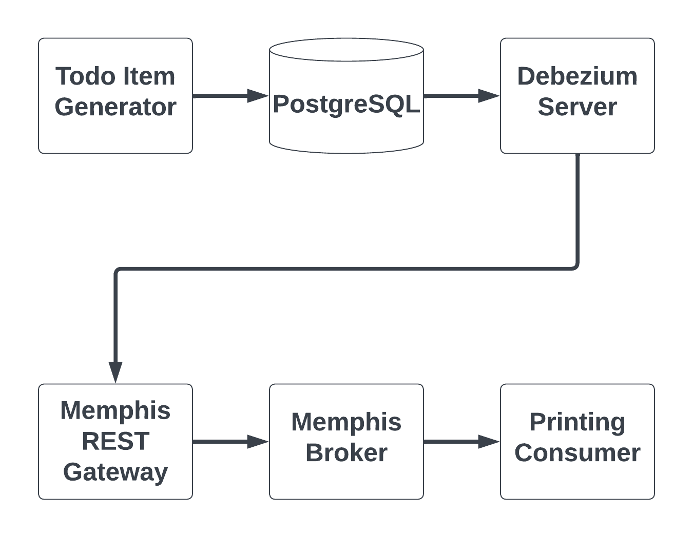

# PostgreSQL Debezium CDC Example

## Use Case Description
Change data capture (CDC) is an increasingly popular pattern for monitoring
granular changes to databases. CDC implementations generate events in response
to changes in data induced by queries (e.g., inserts, deletes, and updates).
The events are then transmitted to external observers (listeners).  CDC effectively
turns the traditional database into event source for an event-driven architecture.

CDC has multiple uses, including:

* Replicating data to secondary databases with implementations optimized for complementary workloads (e.g., transaction vs analytical processing)
* Real-time analytics (e.g., calculations and aggregations that power dashboards)
* Real-time monitoring of suspicious or unexpected events

## Solution Description
In this example solution, we illustrate a CDC solution for PostgreSQL using Debezium that
replaces [Apache Kafka](https://kafka.apache.org/) with the [Memphis.dev](https://github.com/memphisdev/memphis)
message broker.  Memphis.dev requires less operational overhead, making it ideal for lean
teams who want to focus on their customers.

The solution uses the example of a table for storing items in a todo application.  A script
generates random todo items and inserts them into the PostgreSQL database.  The database is
configured with write ahead log (WAL) logical replication.  Debezium is configured in standalone
server mode to listen for events and forward them to Memphis.dev through the REST gateway.  The
CDC events are pulled from the Memphis.dev station by a simple consumer example
that prints the events to the console.  A diagram of the architecture is provided below.

## Steps for Running the Example

1. Build the Docker images:
   `docker compose build --pull --no-cache`
1. Start Memphis.dev:
   `docker compose up -d memphis-rest-gateway`
1. [Configure Memphis.dev](docs/setup_memphis.md)
1. Start the printing consumer:
   `docker compose up -d printing-consumer`
1. Start the todo generator, PostgreSQL database, and Debezium Server:
   `docker compose up -d todo-generator`
1. Check the container statuses (`docker ps`), Memphis.dev station overview, and [Docker logs](docs/inspect_logs.md) to confirm it works
